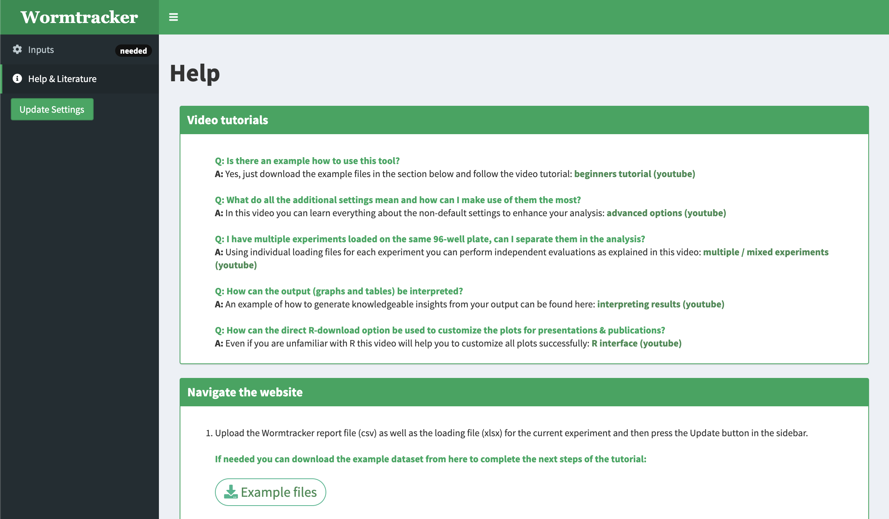
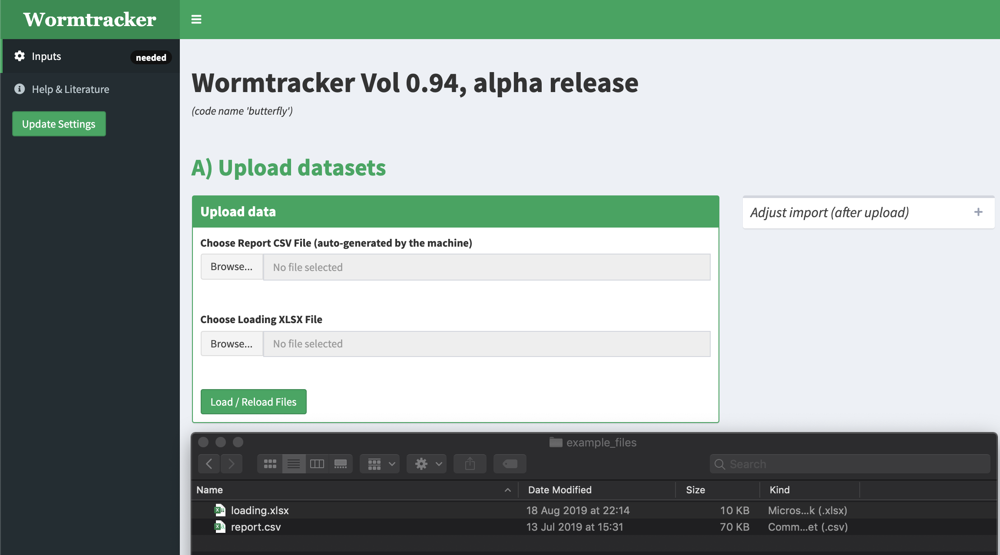
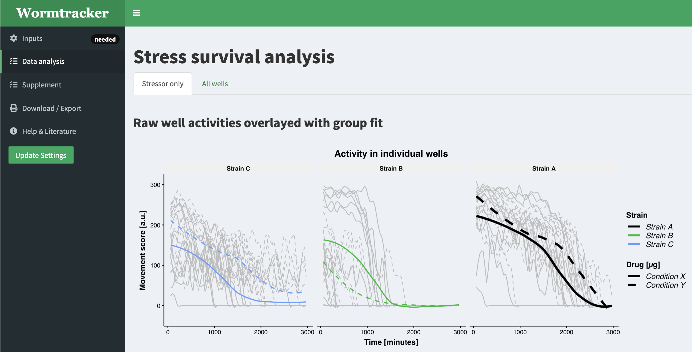
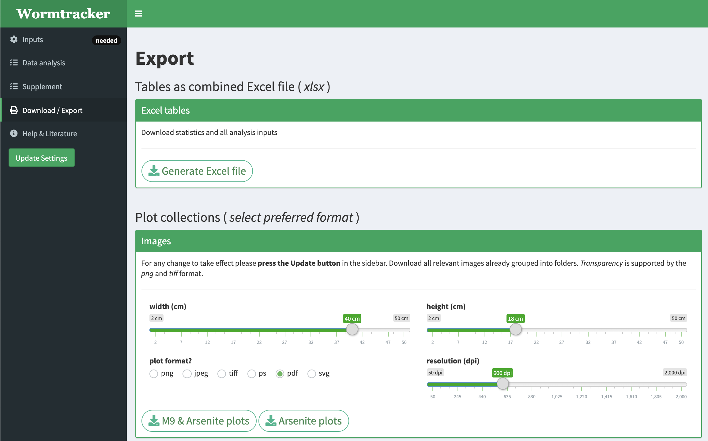

# Microtracker tool

Interactive tool to analyse tabular datasets acquired by the in vivo WMicroTracker system

## Setup
1. Clone repository.
2. Install needed packages (under development).
3. Run App (using [RStudio](https://rstudio.com)).

## App preview

### Optional: download example files

### Submit files for analysis

### Data analysis

### Exporting files
